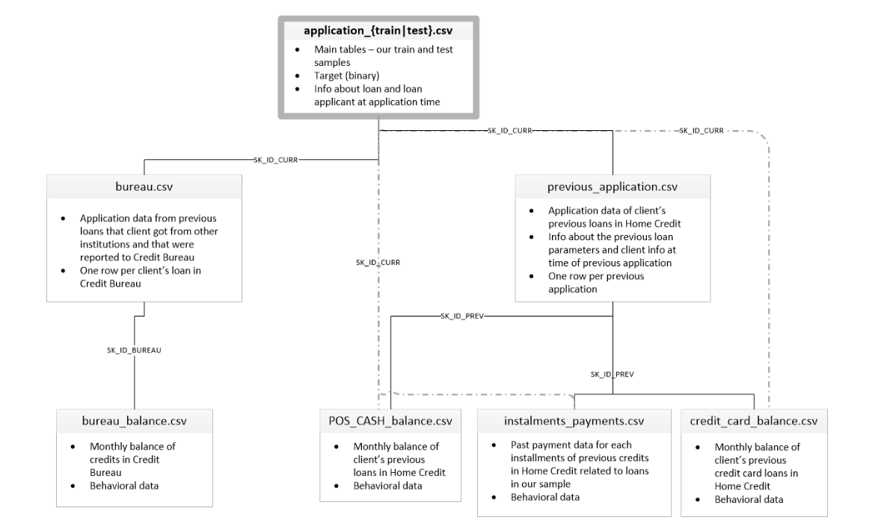
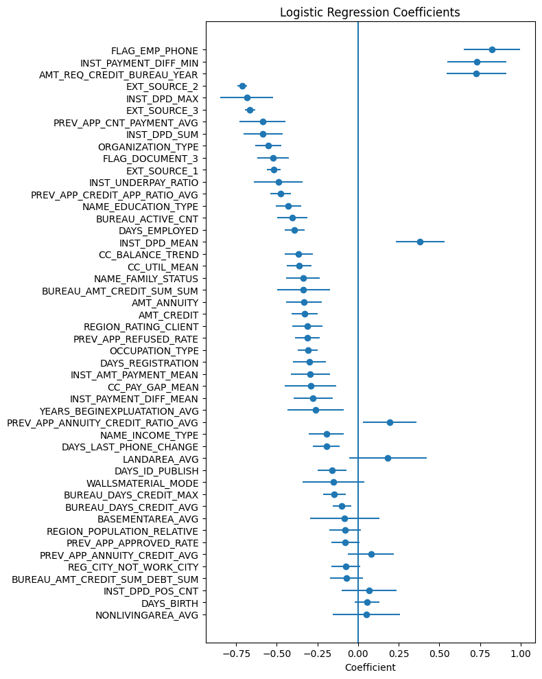

# Credit Scoring
This project implements a binary classification task: predicting the probability  
of client default.

## Data
The dataset for this task can be downloaded from the following link:  
[Home Credit dataset](https://drive.google.com/drive/folders/17qNOwNyzjRDfdFF4EpZSR0JeSvl7Hj70?usp=sharing)  
It is recommended to unzip the archive into the `data/raw` directory in the root of the repository.  

The dataset consists of 8 `*.csv` files. The data schema is shown below:  

I used 6 of them: main application and client information in `application_train.csv` and `application_test.csv`,  
information about past debts to other credit organizations in `bureau.csv`, and information about  previous  
applications to the same bank in `previous_application.csv`.  
Also I used some behaviour and payment discipline features from `instalment_payments.csv` and `credit_card_balance.csv`.

## Approach Used  
### **Data preprocessing**

- Aggregated external tables (`previous_application`, `bureau`, `installments_payments`, `credit_card_balance`) at the client level (`SK_ID_CURR`).
- Created behavioral features:
  - overdue rate,
  - maximum delays,
  - credit utilization metrics,
  - payment gap indicators,
  - balance trends.
- Numerical features were quantile-binned.
- Missing values were treated as a separate bin.
- All binned features were transformed using **Weight of Evidence (WOE)** encoding.
- Feature selection was performed using:
  - Information Value (IV),
  - Gini coefficient,
  - Wald test (p-values),
  - multicollinearity (VIF) checks.

---

### **Model**

- **Logistic Regression** trained on WOE-transformed features.
- Chosen for:
  - interpretability,
  - stability,
  - compliance with classical PD modeling standards.

Two model variants were evaluated:
- Baseline model without `EXT_SOURCE` features.
- Enhanced model including `EXT_SOURCE_1/2/3` (external risk proxies).

---

### **Validation**

- Standard 80/20 user-based split.
- All preprocessing steps (binning, WOE mapping, aggregations) were fitted on the training set only and then applied to validation data to prevent data leakage.

---

### **Loss Function**

- Logistic loss (binary cross-entropy), relating to to Logistic Regression.

---

### **Evaluation Metric**

- **AUC ROC**

Chosen because:
- It measures ranking quality instead of classification accuracy.
- It evaluates predicted probabilities rather than hard labels.
- It is a standard metric in credit risk modeling.
  
## Results  
* Validation metrics: `AUC ROC = 0.715` (without using `EXT_SOURCE_1/2/3` features)  
and `AUC ROC = 0.75` (with `EXT_SOURCE_1/2/3` features)    
* Metrics on the private test set (from Kaggle): `AUC ROC = 0.72` (without using `EXT_SOURCE_1/2/3` features),
and `AUC ROC = 0.74` (with `EXT_SOURCE_1/2/3` features) 

## Importance of the features (from Wald-test)

## How to Run  
1) Clone the repository  
   `git clone https://github.com/yakovlevanton/credit_scoring.git`  
   `cd credit_scoring`
2) Create and activate a virtual environment  
   `python -m venv .venv`  
   Linux/macOS:  
   `source .venv/bin/activate`  
   Windows:  
   `.venv\Scripts\activate`  
3) Install dependencies  
   `pip install -r requirements.txt`  
4) Download and unzip the archive from the link above  
5) Train the model:  
   `python run.py --mode train`  
6) Generate predictions:  
   `python run.py --mode predict --out <path/to/file/.csv>`  
   By default, they will be saved to `predictions/submission.csv`
